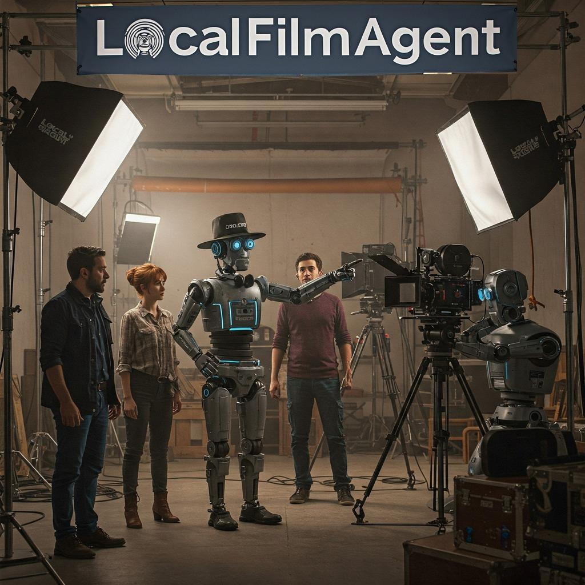

# LocalFilmAgent: A Multi-Agent Framework for End-to-End Film Automation in Virtual 3D Spaces

<h4 align="center">

<div align="center">


<!--  -->

<!-- [](https://filmagent.github.io/)
[](https://arxiv.org/abs/2501.12909)
[](https://www.youtube.com/watch?v=hTI-0777iHU)
 -->

</h4>

#

<p align="center">
  
</p>

## Introduction
This repository is based on [FilmAgent](https://github.com/HITsz-TMG/FilmAgent), but this repository supports local LLMs, 
which the original repo does not. It is especially good if you or your organization has enough GPUs for you to use. Some of possible 
advantages are as follows.

- Don't need to send your data to cloud LLMs.
- Once you download a model, you don't need to access the internet to utilize LLMs (you may need to use the internet to utilize other resources such as web search).
- Can flexibly and locally finetune a LLM model if you want to.
- Don't need to spend money on pay-as-you-go APIs, which are ambiguous and hard to estimate the total costs that you need to pay.
Besides, even if you decide to utilize one of the cloud LLMs later on, using local LLMs first can give you an approximation of the costs 
before using the cloud ones, such as how many tokens a LLM would produce in order to solve your problem. 
- It is also good if you would like to investigate and experiment what kind of outcomes you can expect when you feed your data for internal 
investigation purposes.


## Modification
I have made some modifications in this repo from the original one.
- Enable you to use local LLMs instead of cloud ones. Local LLMs include recently announced reasoning models such as  [**DeepSeek R1**](https://github.com/deepseek-ai/DeepSeek-R1) and [**QwQ**](https://qwenlm.github.io/blog/qwq-32b/).
- Made arguments and some crucial parameters configurable using a JSON config file. For details, please check [config.json](FilmAgent/config.json)
- Made clear the import dependencies because the original code frequently uses `import *`, which is ambiguous and not recommended
- Created a python program to run [ChatTTS](https://github.com/2noise/ChatTTS) without any error since the code the original repo provided generates some errors due to, presumably, the fact that there might have been updates since it was created. Also, enable you to run the program without running a web server, which the original repo does
- Updated [env.txt](FilmAgent/env.txt) to accomodate local LLMs
- Include some examples that were created using Local LLMs. Please refer to [examples](examples/) directory for details


The following video is an example created by LocalFilmAgent specifying `Reconcilation in a friend reunion` as a topic.

https://github.com/user-attachments/assets/eed71332-0ae5-475b-8212-d10958f240e6


**LocalFilmAgent** is a multi-agent collaborative system for end-to-end film automation in 3D virtual spaces. 
LocalFilmAgent simulates key crew roles—directors, screenwriters, actors, and cinematographers, and integrates efficient human workflows within a sandbox environment.

<div align=center></div>


## 🚀 Framework

Following the traditional film studio workflow, we divide the whole film automation process into three sequential stages: idea development, scriptwriting and cinematography, and apply the **Critique-Correct-Verify**, **Debate-Judge** collaboration strategies. After these stages, each line in the script is specified with the positions of the actors, their actions, their dialogue, and the chosen camera shots.

<div align=center></div>


## 🌟 Build Your own Film with LocalFilmAgent

1. Install Package
```Shell
conda create -n filmagent python==3.9.18
conda activate filmagent
pip install -r env.txt
```

2. Adjust [config.json](FilmAgent/config.json) in order to run LocalFilmAgent based on your needs. Run the following commands to get the movie script created by the agents collaboratively. After running the following program, `Script` and `Logs` folders are created and all the deliverables will be there.
```bash
cd /path/to/FilmAgent
conda activate filmagent
python main.py --config_path config.json
```

3. We use [ChatTTS](https://github.com/2noise/ChatTTS) to provide voice acting for the characters in the script. You need to clone [ChatTTS](https://github.com/2noise/ChatTTS) repository and move all the things inside of the repository into the `TTS` directory. Run the following commands to execute the text-to-speech process:
```bash
cd /path/to/TTS
conda create -n tts python==3.9.18
conda activate tts
apt install gcc -y
pip install -r tts_env.txt
python generate_audio.py
```

5. We now have the `script/0.json`, `actors_profile.json`, and a series of `.wav` audio files in `FilmAgent/Audio/` folder. Next, we need to execute the script in Unity. The version of the Unity editor I have tested is **Unity 2022.3.14f1**. You need to download the Unity project file we provide [[Dropbox](https://www.dropbox.com/scl/fi/atxhxnqppeofmt471dxr5/TheBigBang.zip?rlkey=o7zuqficetabkk2h1w1npkv3v&st=5s41rzdv&dl=0)][[Baidu Disk](https://pan.baidu.com/s/10wgfvtcG-xnx1fA9Rd_zwg?pwd=5aif)]. After decompression, open `TheBigBang\Assets\TheBigBang\Manyrooms.unity` with Unity. Then replace all the absolute pathnames '/path/to/' with your specific path in `TheBigBang\Assets\Scirpts\StartVideo.cs` and `TheBigBang\Assets\Scirpts\ScriptExecute.cs`. Press **'ctrl+R'** in the unity interface to recompile, click **'Play'** to enter Game mode, then press **'E'** to start executing the script (sometimes the audio files load slowly, so you may need to play it 2 or 3 times before it can run normally).

<div align=center></div>  


## 🌈 Case Study

### 🤝 What does Multi-Agent Collaboration do?
The following table records some comparisons of the scripts and camera settings **before (⬅️) and after (➡️)** multi-agent collaboration, with excerpts from their discussion process.

<div align=center></div>

📌 **Case Highlights:**
- **Case #1** shows that Director-Screenwriter discussion reduces hallucinations in non-existent actions (e.g., standing suggest), enhances plot coherence, and ensures consistency across scenes.
- **Case #2** shows that Actor-Director-Screenwriter discussion improves the alignment of dialogue with character profiles.
- **Case #3**, in the Debate-Judge method in cinematography, demonstrates the correction of an inappropriate dynamic shot, which is replaced with a medium shot to better convey body language.
- **Case #4** replaces a series of identical static shots with a mix of dynamic and static shots, resulting in a more diverse camera setup.

### ⚖️ Comparison with Sora

<div align=center></div>

While Sora (🔗 [Video](https://github.com/user-attachments/assets/65bb4c12-cba0-4ee9-a673-63ea5103fd76)) shows great adaptability to diverse locations, characters and shots, it **struggles with consistency and narrative delivery**, along with **strange artifacts**. 

In contrast, FilmAgent requires pre-built 3D spaces, but it produces **coherent, physics-compliant** videos with strong **storytelling capabilities**.


## Reference

- [HITsz-TMG/FilmAgent](https://github.com/HITsz-TMG/FilmAgent)
- [ChatTTS](https://github.com/2noise/ChatTTS)